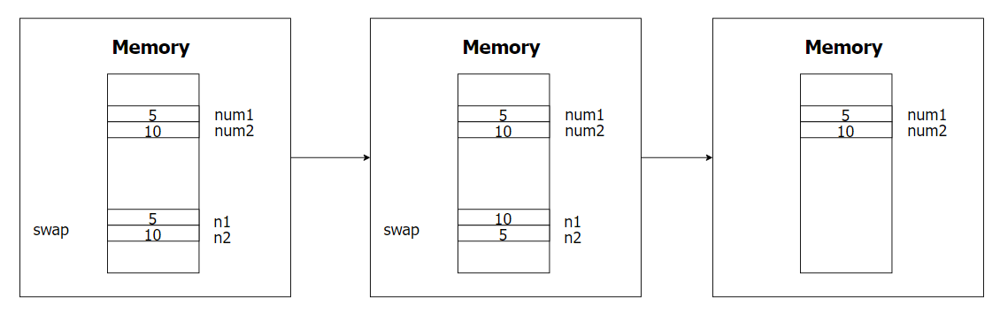
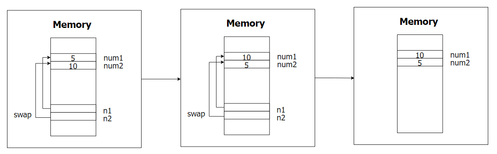
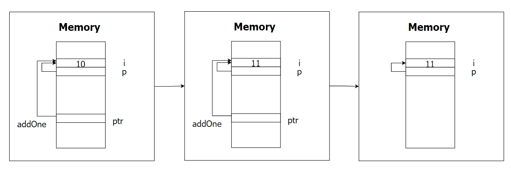
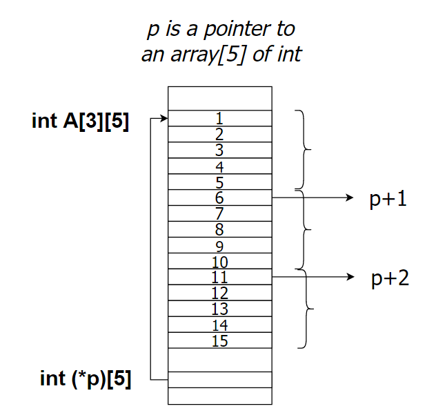
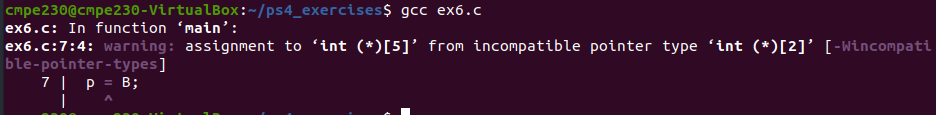
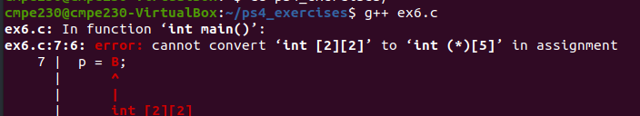
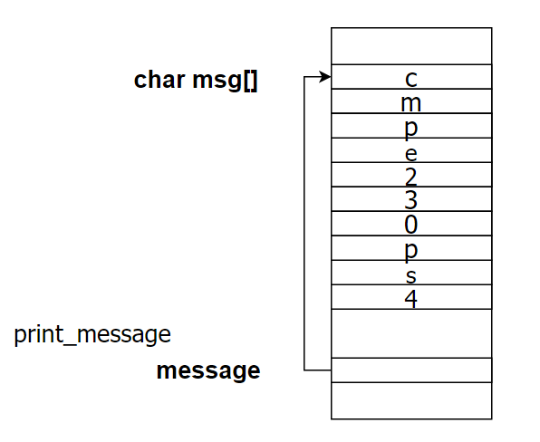
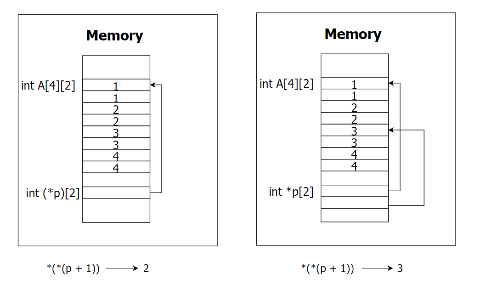

## CMPE 230 - PS 4

### Pointer Arithmetic

```c
#include <stdio.h>
// https://www.geeksforgeeks.org/pointer-arithmetics-in-c-with-examples/
int main()
{
    int x;
 
    // Integer variable
    int N = 4;
 
    // Pointer to an integer
    int *ptr1, *ptr2;
 
    // Pointer stores the address of N
    ptr1 = &N;
    ptr2 = &N;
 
    // Incrementing ptr2 by 3
    ptr2 = ptr2 + 3;
 
    // Subtraction of ptr2 and ptr1
    x = ptr2 - ptr1;
    
    // Print x to get the Increment
    // between ptr1 and ptr2
    printf("Subtraction of ptr1 & ptr2 is %d\n", x);
 
    char *ptr3, *ptr4;
    ptr3 = (char *) ptr1;
    ptr4 = (char *) ptr2;

    printf("Subtraction of ptr4 & ptr3 is %d\n", ptr4 - ptr3);
    return 0;
}

```

### Pass by value

```c
#include <stdio.h>
void swap(int n1, int n2);

int main()
{
	int num1 = 5, num2 = 10;

	swap( num1, num2);

	printf("num1 = %d\n", num1);
	printf("num2 = %d", num2);
	return 0;
}

void swap(int n1, int n2)
{
	int temp;
	temp = n1;
	n1 = n2;
	n2 = temp;
}

```



### Swap

```c
#include <stdio.h>
void swap(int *n1, int *n2);

int main()
{
	int num1 = 5, num2 = 10;

	// address of num1 and num2 is passed
	swap( &num1, &num2);

	printf("num1 = %d\n", num1);
	printf("num2 = %d", num2);
	return 0;
}

void swap(int* n1, int* n2)
{
	int temp;
	temp = *n1;
	*n1 = *n2;
	*n2 = temp;
}

```



### Ex4

```c
#include <stdio.h>

void addOne(int* ptr) {
  (*ptr)++; // adding 1 to *ptr
}

int main()
{
  int* p, i = 10;
  p = &i;
  addOne(p);

  printf("%d", *p); // 11
  return 0;
}
```



### Ex5

```c
#include <stdio.h>

int main()
{
    int (*p)[5]; // pointer to an array[5] of int
    int A[3][5] = {{1, 2, 3, 4, 5}, {6, 7, 8, 9, 10}, {11, 12, 13, 14, 15}};
    
    p = A;
    printf("%d\n", (*(p+1))[1]);
    printf("%d\n", *(p[0]+1));
    printf("%d\n", p[2][1]);
    return 0;
}
```



### Ex6 

```c
#include <stdio.h>

int main()
{
    int (*p)[5]; // pointer to an array[5] of int
    int B[2][2];
    
    p = B;
  	// p = (int (*)[5]) B;
    return 0;
}

```






### Ex 7

```c
#include <stdio.h>

void print_message(char message[]){
    int i;
    for(i = 0;  i < 10; i++){
        printf("%c", message[i]);
    }
}

int main(){
    char msg[] = "cmpe230ps4";
    print_message(msg);
    return 0;
}

```

```c
#include <stdio.h>

void print_message(char *message){
    int i;
    for(i = 0;  i < 10; i++){
        //printf("%c", message[i]);
        printf("%c", *(message+i));
    }
}

int main(){
    char msg[] = "cmpe230ps4";
    print_message(msg);
    return 0;
}

```



### Ex8

```c
#include <stdio.h>

void modify_array(int arr[5]){
    int i;
    
    for(i = 0; i < 5; i++){
        arr[i] *= 2;
    }
}


int main(){
    int A[5] = {1, 2, 3, 4, 5};
    int i;
    modify_array(A);
    for(i = 0; i < 5; i++){
        printf("%d\n", *(A+i));
    }
    return 0;
}

```

### Ex9

```c
#include <stdio.h>

void modify_2d_array(int arr[3][2]){ 
// this is also valid: void modify_2d_array(int arr[][2]);
// this is invalid: void modify_2d_array(int arr[][]);
    arr[0][1] = 5;
}

int main(){
	int A[4][2] = {{1, 1}, {2, 2}, {3, 3}, {4, 4}};
    modify_2d_array(A);
    printf("%d", A[0][1]);
    
    return 0;
}
```

### Ex10

```c
#include <stdio.h>

void modify_2d_array(int (*p)[2]){ // pointer to array[2] of int
    p[0][1] = 5;
}

int main(){
	int A[4][2] = {{1, 1}, {2, 2}, {3, 3}, {4, 4}};
    modify_2d_array(A);
    // printf("%d", A[0][1]);
    int i, j;
    for(i = 0; i < 4; i++){
        for(j = 0; j <2; j++){
           	printf("%d\n", A[i][j]);

        }
    }
    return 0;
}
```

**Incompatible types:** 

````c
#include <stdio.h>

void modify_2d_array(int *p[2]){ // array[2] of pointer to int
    p[0][1] = 5;
}

int main(){
	int A[4][2] = {{1, 1}, {2, 2}, {3, 3}, {4, 4}};
    modify_2d_array(A);
    //printf("%d", A[0][1]);
    int i, j;
    for(i = 0; i < 4; i++){
        for(j = 0; j <2; j++){
           	printf("%d\n", A[i][j]);

        }
    }
    return 0;
}
````

#### `int (*p)[2]` vs `int *p[2]`

```c
#include <stdio.h>

int main(){
	int A[4][2] = {{1, 1}, {2, 2}, {3, 3}, {4, 4}};
	int (*p)[2] = A;
    printf("%d", *(*(p+1)));  
    return 0;
}
```

```c
#include <stdio.h>

int main(){
	int A[4][2] = {{1, 1}, {2, 2}, {3, 3}, {4, 4}};
	int *p[2];
    p[0] = A[0];
    p[1] = A[2];
    printf("%d", *(*(p+1)));  
    return 0;
}
```

